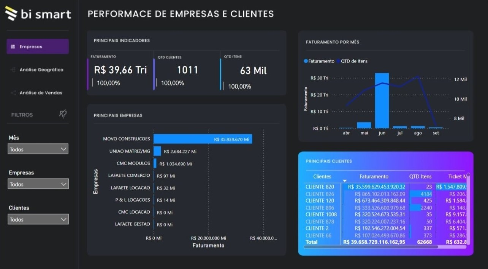

# Data-Analysis-Projects (Portifólio)
Projects dedicated to data analysis

## Análise de Dados: Análise Exploratória de Dados de Logística

> Dados: [loggibud](https://github.com/loggi/loggibud).

> Processamento: Python (Google Colab); Pandas; Geopandas; Matplotlib; Seaborn; Numpy.

> Ferramentas: Python (Google Colab).

## Análise de Dados: COVID-19 Dashboards

> Dados: [csse_covid_19_data](https://github.com/CSSEGISandData/COVID-19/tree/master/csse_covid_19_data/csse_covid_19_daily_reports).

> Processamento: Python (Google Colab).

> Ferramentas: Python (Google Colab); [Looker Studio](https://github.com/yuremartins/Data-Analysis-Projects/blob/main/COVID-19%20Dashboards/covid-dashboard.pdf).

## EDA: Power BI

> Dados: [Database](EDA-BI/Database.xlsx).

> Ferramentas: [Power BI](https://app.powerbi.com/view?r=eyJrIjoiN2MwMmE5YTUtNWNjNS00OGY0LWExYWMtNGY5MDgzYTNkNzg3IiwidCI6ImU4Y2YyNjM5LTFmOTgtNGJiNC1iZDg5LWFiZDE0OTI4OTM3ZiJ9).

## Dashboard: Power BI

> Dados: Azure Data Base, SharePoint, APIS's.

> Ferramentas: [Power BI](https://app.powerbi.com/view?r=eyJrIjoiZTEwYTU0MjUtNWZiYS00ZTYyLWI2NDktMzQ2NzBiNTUxODJjIiwidCI6ImU4Y2YyNjM5LTFmOTgtNGJiNC1iZDg5LWFiZDE0OTI4OTM3ZiJ9).

